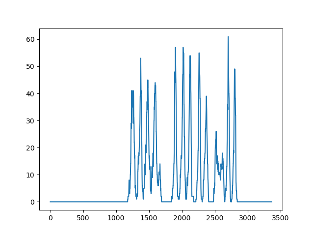

#FCV_Project3
___
## Assumptions for handwritten character extractions:  
- The color used is in contrast to the written surface so that a 
thresholding can pe safely applied to extract written text. For example, black or blue ink on white paper  
- White paper or light colored paper is used 
- The written lines are relatively parallel to each other
## Algorithm used for line extraction:  

The following steps are taken in order to extract lines of text:  
- Transform the image in a binary image
- Find the rectangle with the minimum area that contains all the "white" points (the written text)
- Apply a rotation based on the found rectangle above
- Calculate the average point value for each line (the percentage of pixels corresponding to text) in the warped image. An example of this histogram can be seen below:

- Find all the lines for which there is a change (raising or falling) in percentage

## Algorithm used for character extraction:

The following steps are taken in order to extract handwritten characters:
- Transform the warped image in a gray image
- Apply Canny edge detection algorithm
- Find all the contours based on the edges
- Find the corresponding bounding box (which is big enough to remove the noise) and draw it

## Different approaches that were tried:
- Using EAST Neural Network to detect words:
    - No way to extract individual characters.
    - Relatively poor performance for handwritten words, especially "wavy" lines of text
  
## Usage of software:
From command line, run the code like so: python main.py _<img_path_1>_ _<img_path_2>_ _<...>_  
The SW will write the processed image in the **/data/output** folder adding _processed__ in front of the image name 